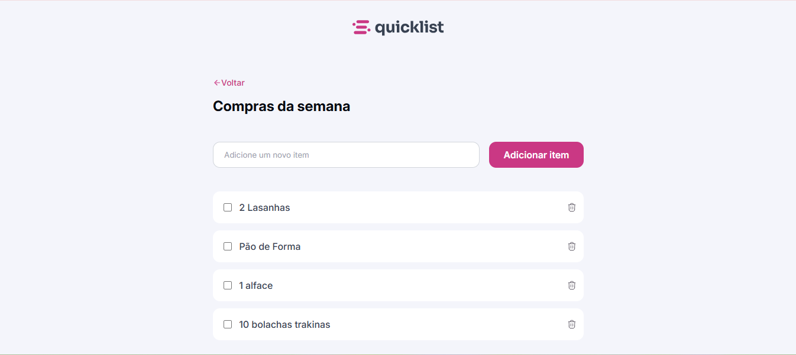
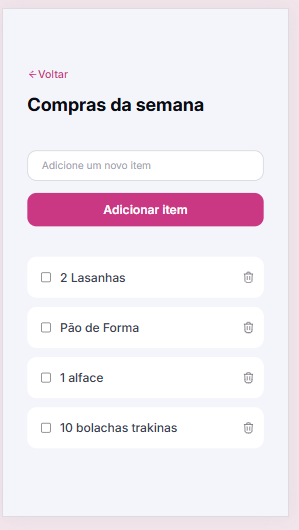

# Quicklist - Compras da Semana 🛒

Este projeto é uma aplicação de lista de compras interativa desenvolvida como um desafio prático da trilha de fundamentos da Rocketseat. A aplicação permite gerenciar itens de mercado de forma dinâmica, com funcionalidades de adição, conclusão e remoção.

## 📱 Visualização do Projeto
Desktop
<p align="center">

</p>

Mobile
<p align="center">

</p>

## 🚀 Tecnologias
Para construir este projeto, utilizei as seguintes tecnologias:

- HTML5: Estruturação semântica da lista e formulários.

- CSS3: Estilização moderna com variáveis CSS, Flexbox para alinhamento e Grid para o layout principal. Além de uso de Media Queries para total responsividade.

- JavaScript (ES6+): Manipulação dinâmica do DOM, gerenciamento de eventos e lógica de estados.

## 📋 Funcionalidades Implementadas
- Adição Inteligente: Criação de novos elementos na lista em tempo real através do formulário.

- Validação de Entrada: O sistema impede a inserção de itens vazios ou apenas com espaços, garantindo a integridade dos dados.

- Marcação de Concluído: Logica de toggle para riscar itens da lista ao marcar o checkbox.

- Remoção de Itens: Exclusão dinâmica de elementos específicos da lista ao clicar no ícone de lixeira.

- Sistema de Alerta: Exibição de uma mensagem de confirmação (Toast) sempre que um item é removido, com a opção de fechá-la manualmente.

- Foco Automático: Após adicionar um item, o campo de entrada é limpo e o foco retorna ao input automaticamente para melhorar a experiência do usuário (UX).

## 🧠 Aprendizados e Desafios
Neste desafio, pude aprofundar meus conhecimentos em:

- Criação Dinâmica de Elementos: Uso de document.createElement() em vez de innerHTML, o que torna o código mais seguro e performático.

- Encapsulamento de Lógica: Organização das funcionalidades dentro de funções reutilizáveis (como a createShoppingList).

- Gerenciamento de Eventos: Aplicação de addEventListener diretamente em elementos criados via script.

## 🛠️ Como rodar o projeto
Faça o clone deste repositório:

Bash
```
git clone https://github.com/seu-usuario/quicklist-rocketseat.git
```
Entre na pasta do projeto:

Bash
```
cd quicklist-rocketseat
```

Abra o arquivo index.html no seu navegador.

* Desenvolvido com 💜 por *Chandilene Borges* durante a jornada na Rocketseat.
